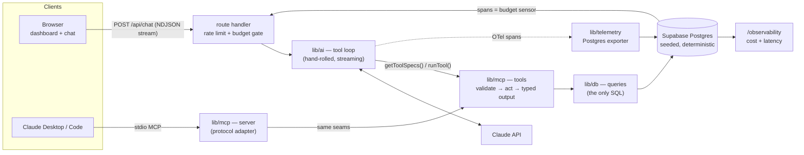

# Venue Insights — Multi-Location Intelligence Platform

**A stakeholder dashboard where the AI analyst sees what you see.** Filter a
portfolio of 50 seeded locations, click *Ask AI* on any chart, and get an
answer grounded in live tool calls against the database — with the cost of
every conversation measured in microdollars on its own observability page.

**Live:** [venue-insights-platform.vercel.app](https://venue-insights-platform.vercel.app)

<!-- TODO(author): record the 30-second demo loop below as docs/demo.gif -->

**The 30-second demo:** open the dashboard → filter to *Verde Taqueria · Q2
2026* (every tile, chart, and table re-scopes; the URL is shareable) → hit
**✦ Ask AI** on the monthly trend → a grounded answer about exactly that
slice streams in, tables rendered as typed components → open
[/observability](https://venue-insights-platform.vercel.app/observability)
and point at what that conversation just cost.

## What this project demonstrates

Built as a portfolio piece for AI-augmented full-stack work at
multi-location SaaS companies — and deliberately **hand-rolled at every
layer that matters**, so each one can be explained, defended, and debugged:

1. **Conversational, tool-grounded search** — a hand-written Claude tool
   loop (no framework): zod-single-sourced tool schemas, parallel tool
   execution, `is_error` recovery, `pause_turn` resume, streaming over
   typed NDJSON events.
2. **Deterministic generative UI** — the model picks tools and arguments; a
   fixed registry maps tool name → typed React component. The model never
   generates markup (testable, XSS-safe, consistent).
3. **One tool implementation, two transports** — the same four tools serve
   the in-process loop *and* a stdio [MCP](https://modelcontextprotocol.io)
   server that Claude Desktop / Claude Code attach to
   ([setup](docs/mcp-server.md)).
4. **A DIY eval harness with honest numbers** — 24 golden cases computed
   from a deterministic seed, three scorers, and a
   [failure taxonomy](#eval-results-real-numbers) instead of a vanity 1.0.
5. **Observability that pays rent** — OpenTelemetry spans (GenAI semantic
   conventions) exported to Postgres power both the cost/latency dashboard
   *and* the public endpoint's daily budget circuit-breaker.

## Architecture



The layers under [`src/lib/`](src/lib) have enforced boundaries (each has a
README with its rules): `lib/db` is the only place SQL lives and returns
domain types; `lib/mcp` tools are pure functions consumed by both
transports; `lib/ai` orchestrates Claude and never touches SQL or JSX;
`lib/telemetry` instruments both.

Two properties make the whole thing testable without credentials or a
model in the loop: the **seed is a pure function** (seeded RNG, fixed end
date — evals can assert exact numbers), and **tests run real migrations +
real SQL on PGlite** (Postgres-in-WASM), including the MCP server, which is
tested through a real protocol client over in-memory transports.

## Eval results (real numbers)

One `pnpm eval` run = 24 cases against the live API, ~$0.57, scored by
three deterministic scorers (2026-07-03):

| Scorer | Mean | What it checks |
|---|---|---|
| Tool selection | **0.896** | did the agent call the tools the case expected (multiset) |
| Argument correctness | **0.958** | did pinned arguments match, best-candidate per call |
| Groundedness | **0.867** | is every numeric claim traceable to tool output (precision-band tolerance) |

The interesting part is the **failure taxonomy** — the misses are mostly
*not* hallucinations: the dominant class is **derived values** (the model
correctly counts a 12-row result and says "12", which appears nowhere as a
literal), followed by deliberate case strictness (the agent answered from
data it already had, or correctly refused an out-of-range question), list
ordinals read as claims, and system-prompt facts. Zero invented dollar
figures. Full analysis in the [writeup](docs/writeup.md#eval-results).

Every turn also lands in Postgres as an OTel trace — cost is integer
microdollars ($/MTok ≡ µ$/token, so pricing is pure integer arithmetic) —
and the same spans table feeds the chat endpoint's **daily budget breaker**
(per-IP rate limit + spend ceiling, [ADR-0007](docs/adr/0007-public-endpoint-cost-protection.md)).

## Stack

| Layer | Choice |
| --- | --- |
| Frontend | Next.js 16 (App Router) · React 19 · TypeScript strict · Tailwind v4 · shadcn/ui |
| AI | Raw `@anthropic-ai/sdk` (hand-rolled tool loop — deliberately no AI framework) |
| MCP | `@modelcontextprotocol/sdk` v1, low-level Server (stdio) |
| Data | Postgres on Supabase · Drizzle ORM · PGlite for credential-free tests |
| Evals / obs. | DIY TypeScript harness via Vitest · OpenTelemetry (GenAI semconv) → Postgres |
| Tooling | Vitest (123 tests) · ESLint · Prettier · GitHub Actions · Vercel |

## Getting started

**Prerequisites:** Node 20+, [pnpm](https://pnpm.io), a Postgres URL
(Supabase free tier works), an Anthropic API key.

```bash
pnpm install
cp .env.example .env.local    # fill in ANTHROPIC_API_KEY + DATABASE_URL
pnpm db:migrate && pnpm seed  # deterministic: 5 brands / 50 locations / 733 reviews / 17,330 metric rows
pnpm dev                      # http://localhost:3000
```

| Script | Does |
| --- | --- |
| `pnpm check` | typecheck + lint + format + 123 tests (the CI gate; no API calls) |
| `pnpm ask "…"` | one tool-grounded question from the terminal |
| `pnpm eval` | 24-case eval run → `eval-reports/run-*.md` (**costs ~$0.60 of API tokens; never in CI**) |
| `pnpm mcp` | the stdio MCP server ([client setup](docs/mcp-server.md)) |
| `pnpm seed` | reset + reseed the database (idempotent, deterministic) |

> **Offline builds:** `pnpm build` downloads the Geist fonts from Google
> Fonts (`next/font/google`) — a network-blocked environment fails at that
> step until Next's font cache is primed.

## Project docs

- [`docs/writeup.md`](docs/writeup.md) — the architecture narrative: every major decision, its alternatives, and what it cost
- [`docs/DECISIONS.md`](docs/DECISIONS.md) — decision log, one line each
- [`docs/adr/`](docs/adr) — ten architecture decision records
- [`docs/mcp-server.md`](docs/mcp-server.md) — Claude Desktop / Claude Code setup

## License

[MIT](LICENSE)
